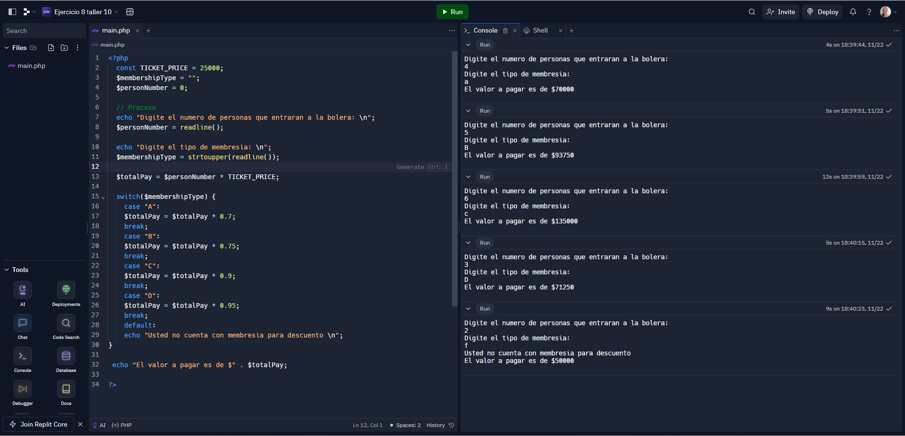

<h1>Taller 10 - Diana Alejandra Rodríguez Casas</h1>

<h2>Información</h2>

Curso:Full Stack Básico -  Grupo 1

Profesor:Cristian Patiño

<h2>Punto 1: Constantes y Variables</h2>

<h2>Punto 2: Sumas de Constantes y Variables</h2>

<h2>Punto 3: Suma de dos números indicados por el usuario</h2>

<h2>Punto 4: Datos del usuario en consola</h2>

<h2>Punto 5: Entrada de bolera usando If / Else</h2>

<h2>Punto 6: Detección de mayoria de edad</h2>

<h2>Punto 7: Selección de operación aritmética</h2>

<h2>Punto 8: Entrada de bolera usando Switch</h2>

<h2>Punto 9: Tabla de multiplicación usando While</h2>

<h2>Punto 10: Números pares usando While</h2>

<h2>Punto 11: Números impares usando For</h2>

<h2>Punto 12: Tabla de multiplicación usando For</h2>

<h2>Punto 13: Suma de valores de un arreglo usando Foreach</h2>

<h2>Punto 14: Revisión de contraseña</h2>

<h2>Punto 15: Selección de operación aritmética usando funciones</h2>
